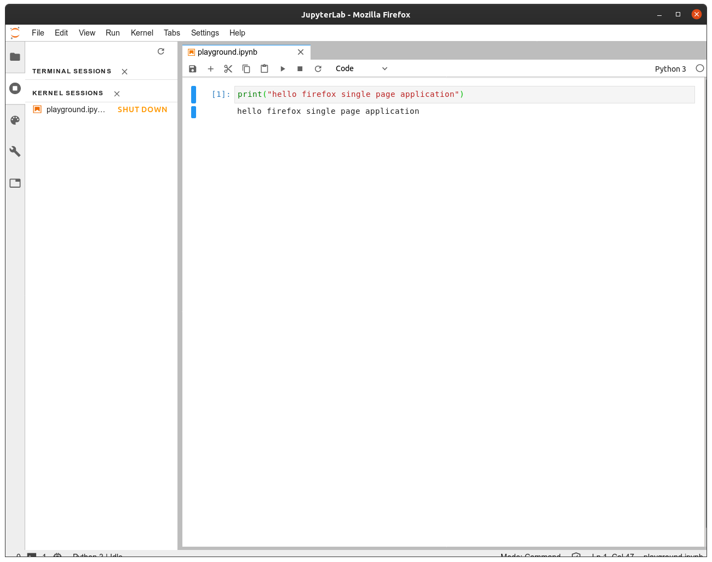
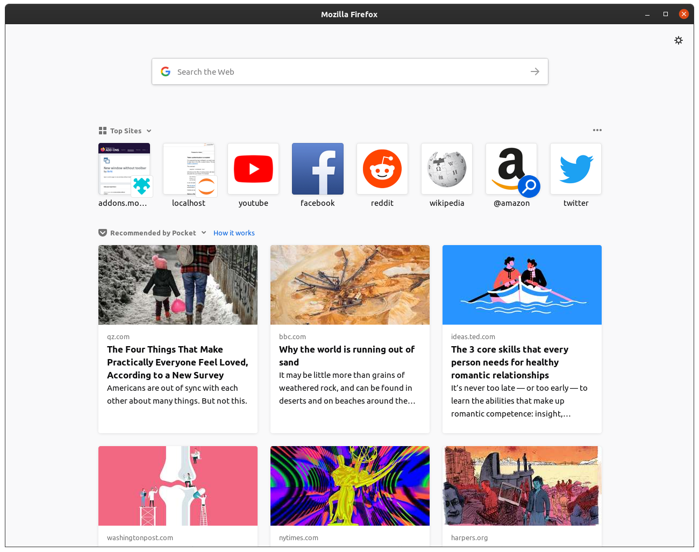

# Use JupyterLab as a Desktop Web App with Firefox on Linux

## Description
There are plenty blogs about running JupyterLab as a desktop app using Chrome/Chromium; however, since Chromium is now a snap package on Ubuntu, accessing the Jupyter runtime file becomes a problem because of the snap's confinement. So, the other option is to use Firefox instead of Chrome/Chromium.

Firefox, unfortunately, does not have a counterpart of Chrome's `-app` option, so there will be a little more work than the Chrome/Chromium solution. This markdown is to document how to use Firefox to accomplish that.

## Screenshot


## Procedure

Because Firefox doesn't have a direct counterpart of Chrome's `-app` option, we will need to do a couple things on the Firefox side. 

### 1. Create a new Firefox profile

Open Firefox profile manager using one of the following methods:
    
  1. run `firefox -ProfileManager` in a terminal
  2. open Firefox and type `about:profiles` in the address bar

Here, my new profile is named *web-app*. Then launch a new Firefox instance using the new profile. 

### 2. Hide everything except content area for the new Firefox profile
We are going to hide the tool bar and address bar on the Firefox with the new profile. First thing we need to do is to make sure the titlebar is enabled on the new Firefox profile (ie. make sure on the Firefox customize page, the bottom left corner, the **Title Bar** is toggled on).

You can refer to this [StackExchange](https://superuser.com/questions/977912/firefox-hide-everything-except-content-area-of-the-browser/1269912#1269912) for the rest of this step. And I will describe the method I used for Firefox Quantum.
  1. type `about:config` in Firefox address bar
  2. set `toolkit.legacyUserProfileCustomizations.stylesheets` to `true`
  3. go to Firefox profile manager by typing `about:profiles` and open the profile directory for the profile we just created.
  4. create a new file `chrome/userChrome.css` including the parent folder if it doesn't exist.
  5. copy and paste the following content into the `chome/userChrome.css` file
      ```css
      /*
       * Do not remove the @namespace line -- it's required for correct functioning
       */
      @namespace url("http://www.mozilla.org/keymaster/gatekeeper/there.is.only.xul"); /* set default namespace to XUL */

      /*
       * Hide tab bar, navigation bar and scrollbars
       * !important may be added to force override, but not necessary
       * #content is not necessary to hide scroll bars
       */
      #TabsToolbar {visibility: collapse;}
      #navigator-toolbox {visibility: collapse;}
      browser {margin-right: -14px; margin-bottom: -14px;}
      ```
  6. Restart Firefox with the new profile, you should see something like this
  

  
### 3. Modify JupyterLab's config file
  
